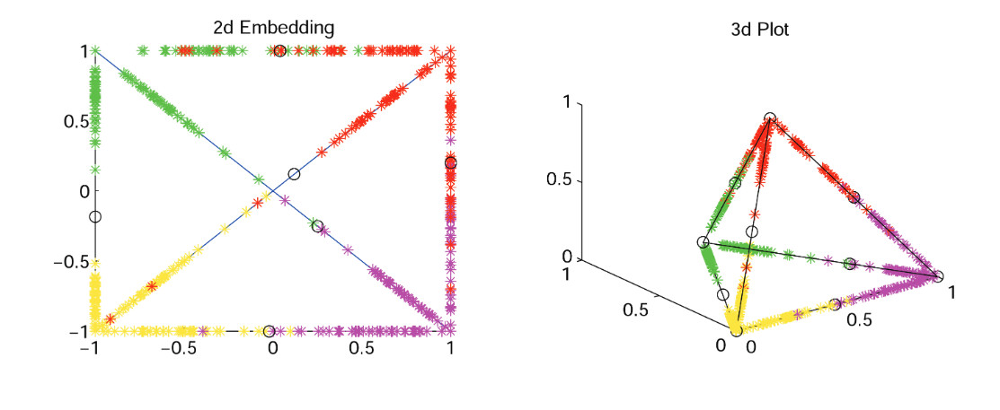

# I liked machine learning before it was cool.

https://www.linkedin.com/pulse/i-liked-machine-learning-before-cool-ben-lackey/
October 1, 2016

A few years ago I started interviewing at machine learning startups.  An interesting crop of them had popped up, all aimed at selling machine learning to the enterprise.

I’d first become interested in machine learning when working with Mike Mozer at CU Boulder over a decade earlier.  That led to undergrad research work on neural nets and later masters work on an area of machine learning called statistical learning theory.  When I popped out of school in 2005 I was ready to go change the world with intelligent machines.  

Unfortunately there were few jobs to be had, and the machine learning or artificial intelligence jobs at the time tended to be in places like Microsoft Research or perhaps buried in the bowels of Amazon making recommendation engines or at Google perfecting spam filters.  Either way the interesting parts of machine learning seemed to be done only by PhDs with large groups of people to do all the wiring and data manipulation working for them.

Machine learning in 2005 was an outgrowth of artificial intelligence that had achieved acceptance only in the earliest of the early adopters.  

In 2008 I was working for TIBCO when they bought Insightful, the company behind S+ which is a derivative of S, which is, in turn, what R is derived from.  It looked like the perfect opportunity -- embed S+ inside TIBCO’s new in memory data grid and get a scalable platform to do machine learning in real time.  The only problem was that Insightful had been acquired to provide basic statistics for a BI tool called Spotfire.  Despite the prettiest of slide decks touting the integration and a very nifty demo for real time bond pricing, that went nowhere and we went on selling application infrastructure.

All that brings us to 2014.  Well into the post credit crunch recovery VCs were pouring money into a crop of very interesting machine learning startups.  Names that caught my eye included 0xdata (later renamed H2O), Graphlab (later renamed Dato, then Turi, then bought by Apple), Context Relevant and many more.  The majority of these companies had $20-$200m and were trying to figure out how to help the Fortune 500 across the machine learning chasm.

It didn’t work.  Most of these companies are now gone, about to be gone, or swallowed up in acquihires for peanuts.  There seem to be a variety of reasons for this failure.  My theories include:

* Machine learning isn’t solving a new problem.  Companies have been using SAS and SPSS to optimize their business for decades.   Yes, deep learning or a GBT may improve classification performance, but it’s an incremental improvement, not a sea change. Many companies are better off buying a packaged solution for those use cases than attempting to shoehorn a shiny new widget in so they can get an extra 0.0005% accuracy.
* Bad salesmanship.  Machine learning sales should be all about the use case, not a generic use case, but a customer's specific high value use case, something I've heard referred to as a crown jewel process.  Every potential customer has heard about fraud detection, customer churn and predictive maintenance from every advanced analytics vendor out there. At this point, you're not going to come in and revolutionize fraud detection for a credit card company. Sorry. Besides repeating the same tired use cases, there's the ever present danger of accidentally pitching a smarter dashboard. Machine learning has value when operationalized, not when turned into a pretty graph.
* Poor alignment of cost model.  From a technical perspective machine learning is really really bursty.  It’s more bursty than almost anything else I can think of.  When I want a model trained, I want it now.  Throw 100,000 cores at that please and have it finish in 5 seconds...  Then I want those machines to go away until I need to retrain. Maintaining 500 machines on premises that idle 90% of the time so that a data scientist can train a model in a reasonable amount of time is not a great use of resources.

Fast forward just two years to today…  The three big cloud providers - Amazon, Microsoft and Google are all pushing very interesting SaaS models for machine learning:

* Amazon - https://aws.amazon.com/machine-learning/
* Azure - https://azure.microsoft.com/en-us/services/machine-learning/
* Google - https://cloud.google.com/ml/

The SaaS approach seems to deal with the burstiness issue. There's a lot of amazing infrastructure out there for machine learning now. No one in their right mind would code a neural net from scratch anymore and you'd have to be a little crazy to pay for your own hardware for training.

One aspect of the bad sales guy issue may have been resolved with SaaS as well -- as a data scientist I can now access the software immediately, determine if it meets my needs and then scale it arbitrarily. I don't have to wait for an NDA to process to get access to the bits for some super secret ML software.

The open question I see is more around adoption. Only a few early adopters, like Netflix, have built machine learning into their core business. All companies have a desire to get value from their data. Many attempt to do that by hiring some data scientists and putting them in a closet somewhere. Whether those data scientists are using SAS or Google ML they're nothing more than glorified report writers unless you find a way to operationalize the insights they gather.

The biggest opportunity I see in machine learning today isn't around the technology. Instead, it's in finding a way to fill the gap between amazing SaaS ML tools provided by cloud vendors and businesses that can't figure out how to leverage those tools. Cloud vendors want to ease that hurdle as it will drive sales. End users want to adopt faster because it is one area where IT can provide competitive advantage.

Machine learning is eating the world as software already has. I’m really excited to see where this space goes.  It seems to be changing faster and faster.
